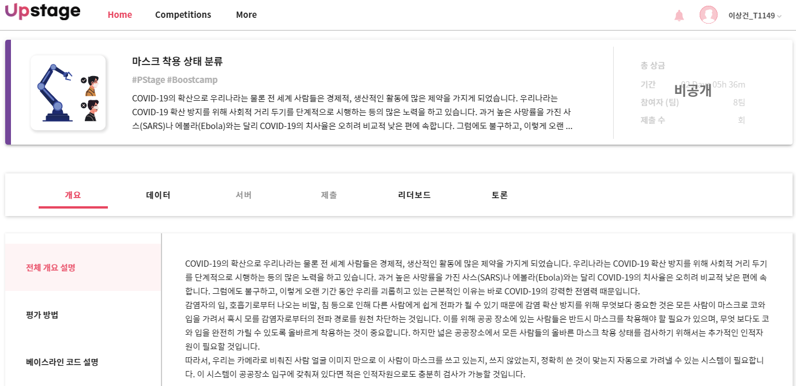

# ai tech boostcamp
# P-stage 1 (이미지 분류)
## 마스크 착용 상태 분류
  

<object data="부스트캠프 랩업 리포트.pdf" type="application/pdf" width="700px" height="700px">
    <embed src="부스트캠프 랩업 리포트.pdf">
        
<a href="부스트캠프 랩업 리포트.pdf">부스트캠프 랩업 리포트.pdf</a>

    </embed>
</object>

## Components

<code>dataset.py</code>

<li>마스크 데이터셋을 읽고 전처리를 진행한 후 데이터를 하나씩 꺼내주는 Dataset 클래스를 구현한 파일입니다.</li>

<li>이 곳에서, 나만의 Data Augmentation 기법 들을 구현하여 사용할 수 있습니다.</li>

<code>loss.py</code>

<li>이미지 분류에 사용될 수 있는 다양한 Loss 들을 정의한 파일입니다</li>

<li>이외에, 성능 향상을 위한 다양한 Loss 를 정의할 수 있습니다.</li>

<code>model.py</code>

<li>데이터를 받아 연산을 처리한 후 결과 값을 내는 Model 클래스를 구현하는 파일입니다.</li>

<li>이 곳에서, 다양한 CNN 모델들을 구현하여 학습과 추론에서 사용할 수 있습니다.</li>

<code>train.py</code>

<li>실제로, 마스크 데이터셋을 통해 CNN 모델 학습을 진행하고 완성된 모델을 저장하는 파일입니다.</li>

<li>다양한 hyperparameter 들과 커스텀 model, data augmentation 등을 통해 성능 향상을 이룰 수 있습니다.</li>

<code>inference.py</code>

<li>학습 완료된 모델을 통해 test set 에 대한 예측 값을 구하고 이를 .csv 형식으로 저장하는 파일입니다.</li>

<code>evaluation.py</code>

<li>inference.py를 통해 나온 예측 값 파일을 GT 와 비교하여 score 를 산출하는 파일입니다</li>

<code>train_mask.py, train_gender.py, train_age.py </code>  
<code>test_mask.py, test_gender.py, test_age.py, test_merge.py</code>
<li>위 baseline code를 개조하여 앙상블하기 위해 만들었습니다. 각 파일 하나당 그에 해당하는 label을 훈련, 예측값을 반환합니다.</li>

