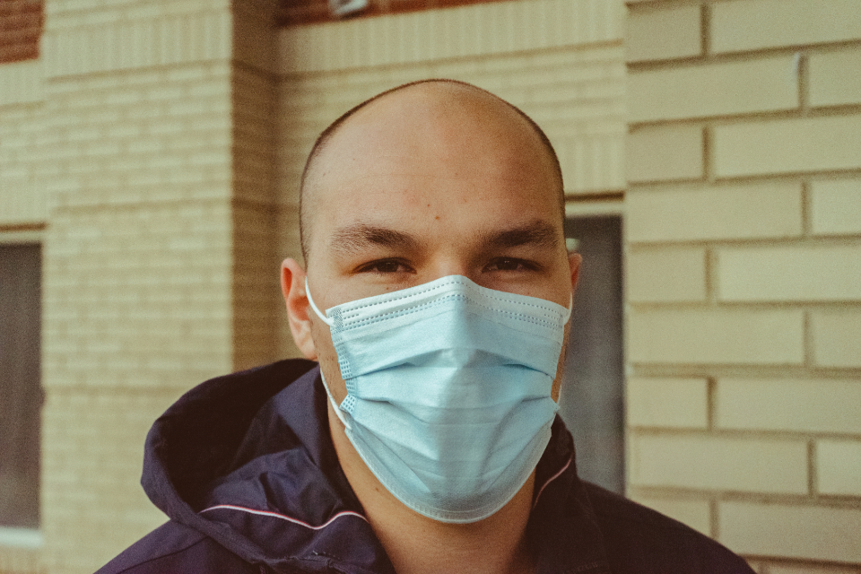

# ai tech boostcamp
# P-stage 1 (이미지 분류)
## 마스크 착용 상태 분류
  

<object data="부스트캠프 랩업 리포트.pdf" type="application/pdf" width="700px" height="700px">
    <embed src="부스트캠프 랩업 리포트.pdf">
        
<a href="부스트캠프 랩업 리포트.pdf">부스트캠프 랩업 리포트.pdf</a>

    </embed>
</object>

<object data="피어세션 발표.pdf" type="application/pdf" width="700px" height="700px">
    <embed src="피어세션 발표.pdf">
        
<a href="피어세션 발표.pdf">피어세션 발표.pdf</a>

    </embed>
</object>

## 학습 데이터 개요
마스크를 착용하는 건 COIVD-19의 확산을 방지하는데 중요한 역할을 합니다. 제공되는 이 데이터셋은 사람이 마스크를 착용하였는지 판별하는 모델을 학습할 수 있게 해줍니다. 모든 데이터셋은 아시아인 남녀로 구성되어 있고 나이는 20대부터 70대까지 다양하게 분포하고 있습니다. 간략한 통계는 다음과 같습니다.

<li>전체 사람 명 수 : 4,500</li>

<li>한 사람당 사진의 개수: 7 [마스크 착용 5장, 이상하게 착용(코스크, 턱스크) 1장, 미착용 1장]</li>

<li>이미지 크기: (384, 512)</li>

학습 데이터와 평가 데이터를 구분하기 위해 임의로 섞어서 분할하였습니다. 60%의 사람들은 학습 데이터셋으로 활용되고, 20%는 public 테스트셋, 그리고 20%는 private 테스트셋으로 사용됩니다

진행중인 대회의 리더보드 점수는 public 테스트셋으로 계산이 됩니다. 그리고 마지막 순위는 private 테스트셋을 통해 산출한 점수로 확정됩니다. private 테스트셋의 점수는 대회가 진행되는 동안 볼 수 없습니다.

<b>입력값.</b> 마스크 착용 사진, 미착용 사진, 혹은 이상하게 착용한 사진(코스크, 턱스크)

예시:  

<b>※원래 대회용 훈련 데이터셋은 저작권 문제로 유사한 외부 사진으로 대체합니다.</b>

<b>결과값.</b> 총 18개의 class를 예측해야합니다. 결과값으로 0~17에 해당되는 숫자가 각 이미지 당 하나씩 나와야합니다.

예시:

7 (the class of cfe1268.jpg)

2 (the class of 3a2662c.jpg)

…

<b>Class Description:</b>

마스크 착용여부, 성별, 나이를 기준으로 총 18개의 클래스가 있습니다.  
  

## Components

<code>dataset.py</code>

<li>마스크 데이터셋을 읽고 전처리를 진행한 후 데이터를 하나씩 꺼내주는 Dataset 클래스를 구현한 파일입니다.</li>

<li>이 곳에서, 나만의 Data Augmentation 기법 들을 구현하여 사용할 수 있습니다.</li>

<code>loss.py</code>

<li>이미지 분류에 사용될 수 있는 다양한 Loss 들을 정의한 파일입니다</li>

<li>이외에, 성능 향상을 위한 다양한 Loss 를 정의할 수 있습니다.</li>

<code>model.py</code>

<li>데이터를 받아 연산을 처리한 후 결과 값을 내는 Model 클래스를 구현하는 파일입니다.</li>

<li>이 곳에서, 다양한 CNN 모델들을 구현하여 학습과 추론에서 사용할 수 있습니다.</li>

<code>train.py</code>

<li>실제로, 마스크 데이터셋을 통해 CNN 모델 학습을 진행하고 완성된 모델을 저장하는 파일입니다.</li>

<li>다양한 hyperparameter 들과 커스텀 model, data augmentation 등을 통해 성능 향상을 이룰 수 있습니다.</li>

<code>inference.py</code>

<li>학습 완료된 모델을 통해 test set 에 대한 예측 값을 구하고 이를 .csv 형식으로 저장하는 파일입니다.</li>

<code>evaluation.py</code>

<li>inference.py를 통해 나온 예측 값 파일을 GT 와 비교하여 score 를 산출하는 파일입니다</li>

<code>train_mask.py, train_gender.py, train_age.py </code>  
<code>test_mask.py, test_gender.py, test_age.py, test_merge.py</code>
<li>위 baseline code를 개조하여 앙상블하기 위해 만들었습니다. 각 파일 하나당 그에 해당하는 label을 훈련, 예측값을 반환합니다.</li>

## 랩업 리포트
  
  
  
  
  
  
  

## 피어세션 발표
  
  
  
  
  
  
